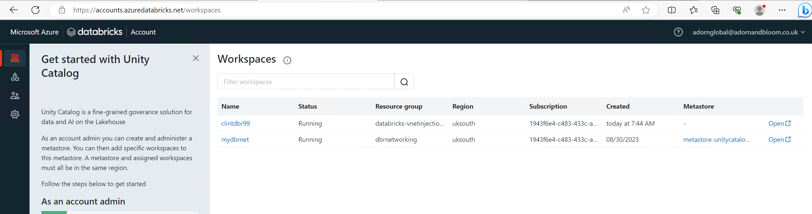

# azure-databricks-privatenetwork-bicep
 how to deploy a databricks inside a private virutal network and a VM to connect to it
(I have taken my idea from this all in one template, but added a few things in myself https://github.com/Azure/azure-quickstart-templates/blob/master/quickstarts/microsoft.databricks/databricks-all-in-one-template-for-vnet-injection/main.bicep)

This is a Devops Pipeline to deply databricks in private virtual network
Clint Grove. September 2023. 

I have deployed this pipeline to my own personal Azure subscription and it works.

You will use the Library in Devops to save a password for the Virtual Machine, never put the password in the code. 
You will use the Service Connection which connects Devops to Azure to deploy these resources to a new Resource Group

The virtual machine is a windows 10. It sits on the same vnet as the databricks. 

The first time you try to log into the databricks workspace from the VM you will get this error

#### The workspace you are trying to access does not exist in this Azure region, or your account adornglobal@adornandbloom.co.uk does not belong to any Databricks workspace in the region. Please ask your administrator to add you as a user, or click here to logout of Azure Active Directory and login with a different user.

What you need to do is go to the account page of databricks and add your workspace to the catalog. https://accounts.azuredatabricks.net/login
You must also have a single Azure databricks connector resource in your subscription, you can use it for multiple databricks instances. 

I signed in as adorn, which is my tenant and domain admin account. 

You can see that the new workspace databricks is not on a metastore. 
go to the Data part of the account page, then click on the metastore that you have already or create a new one. Then go to "workspaces" tab. 
Then click "assign to workspace", then find your new databricsk workspace and click and then assign. 

Go back to "workspaces" blade on the account portal. Then go to "permissions" inside the workspace. 
"add permissions" and add adorn as an admin

And you are in! 

## GitHub actions
If you want to use Actions in GitHub then make sure to create Azure credentials

`az ad sp create-for-rbac --name "myServPrincforGithub" --role contributor --scopes /subscriptions/3908-blah-blah/resourceGroups/yourRGnamehere --json-auth`